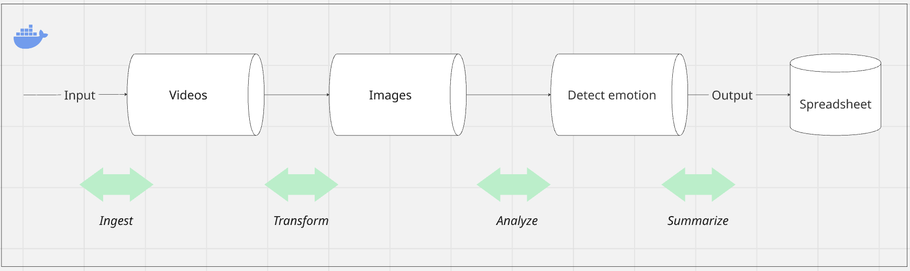

# Analysis of emotional responses in Dutch TV talk shows
<p align = "center">
    
</p> 
Shiela is a media studies scholar who is interested in the analysis of emotional responses within Dutch talk shows. She feels that certain popular talk show hosts are able to get an increased emotional response from their guests over other talk show hosts even with same topics discussed with same guests between different shows.

To validate her assumption, she wants to use a tool that can detect emotions based on video input. This way she does not have to watch all the videos she collected in her research corpus. 

She knows that there is a tool out there that can give probability scores for each type of emotion but she is not proficient enough with programming to be able to use the tool without performing a lot of manual tasks.


---

## Table of Contents
- [Design rivers](#design-drivers)
- [Design](#design)
- [Installation instructions for Shiela](#installation-for-Shiela)
- [Installation instructions for developers](#installation-for-developers)
- [Features](#features)
- [Usage](#usage)
- [Future work](#future-work)
- [Challenges](#challenges)
- [Lessons Learnt](#lessons-learnt)

---

## Design drivers

I have used Shiela's pain points as the main motivation for driving the development of this project. 

Shiela's pain points based on my understanding seem to be as follows:

Assumption #1: The tool must be easy to use for her. Ease-of-use for her means that she need not know about programming to use the tool.

Assumption #2: In this MVP, I used short videos from pexels.com to avoid copyright issues. I chose the videos based on emotions displayed in the video. 

---

## Design

<p align = "center">
    
</p> 

The design consists of four phases:

Ingest: In this phase, a video is taken as input from the user. 
```
Responsible files: main.py(), video_loader.py  
```
Transform: The video is transformed into frames.  
```
Responsible files: frame_extractor.py  
```
Analyze: The emotion in each frame is analyzed.  
```
Responsible files: emotion_analyzer.py  
```
Summarize: The results of the analysis are shown through a CSV. The dominant emotion in each video is noted.  
```
Responsible files: result_writer.py  
```

```
emotion_pipeline.py is the glue that sticks all the phases together. This is done so that separation of concerns is maintained  
```

---

## Installation For Shiela
Step-by-step instructions to get the project running locally.


# Clone the repository
git clone <repo-url>

# Move into project directory
cd <project-folder>

# Install dependencies
pip install -r requirements.txt

---
## Installation For developers
---

## Features

This section describes the features built in the project.

---

## Usage

This section details a GIF of how to use the tool and how to run it. The aim of this section is to help the user run the tool and also show the running features of the tool

---

## Future work

1) Speed vs accuracy: In this MVP, I think that speed of processing is more important than accuracy from a software engineering perspective. Of course, when the tool is complete accuracy of the results will matter for Shiela to keep using the tool. In this MVP, speed is not given a priority but it will matter in the long run. For example, to process videos longer than certain time interval or the ability of the tool to process large number of videos at once, will require the code to be optimized for speed.

2) Providing UI with drag and drop functionality. A simple UI where Shiela can hit a button to upload videos and process them provides much easier ease-of-use to Shiela than having to run commands in CLI.

3) Add the opportunity to the user to provide multiple videos as input at once.

4) Include the functionality to recognize the person in each frame and the respective dominanting emotion for each person in the person. Currently, the MVP supports finding one dominant emotion in the video. For Shiela, if she is inspecting the emotions between the host and guest in a talk show, it would be convinient for her to know the individual emotions faced by different people. This would match with her overall goal to find out if certain talk show hosts are able to get an increased emotional response from their guests compared to other talk show hosts or not.

---

## Challenges

1) Separating responsibilities between each component: I came up with a design to create separation of concerns between each component. Sometimes, design and development go in slightly different ways. I managed to stick with my original design and keep different components separate. This made the pipeline modular and testable.

2) Handling edge cases: In the beginning I had difficulties with invalid values generated by one component being passed downstream. I had to handle these edge cases such as filtering invalid frames, handling empty or failed reads and return expected formats properly.

3) Dockerizing the application: The application contains libraries like Open CV and pandas. These libraries have circular dependencies with other libraries. Even though these libraries are not used in the project directly, their impact on the project needs to considered. That is why my requirements.txt contains libraries that are not used directly in this project. I had issues with missing system libraries in my docker file. Also, I faced problems with docker unable to open imshow() which is used to open the video being processed and play it. Since imshow() only showed the video being processed, I decided to comment it and see what happens. This worked. I had two options: either to do this or use opencv-python-headless. I was not sure what the challenge would be on my development if I used opencv-python-headless. So I decided to stick with opencv-python and comment out imshow() in this MVP. I also had issues with access to files by docker to my local folder. I managed to fix it by looking at docker desktop UI by making changes to settings. In the end, I had issues with the results being created in the docker but not in my local machine. I was able to fix this by providing different path values for running locally and while running in the docker environment.

