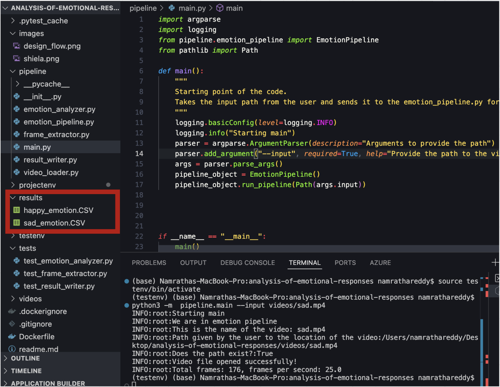
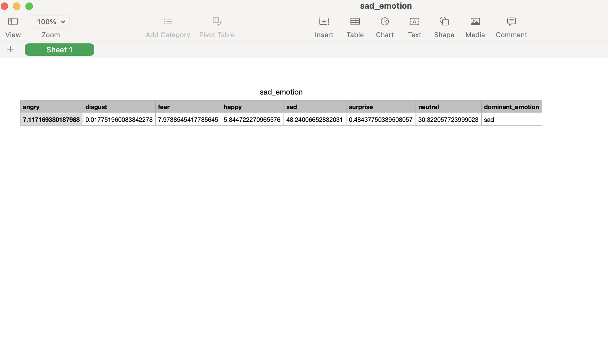
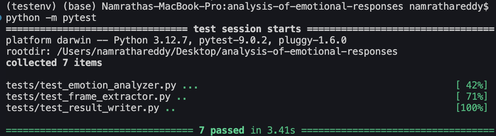

# Analysis of emotional responses in Dutch TV talk shows
<p align = "center">
    
</p> 
Shiela is a media studies scholar who is interested in the analysis of emotional responses within Dutch talk shows. She feels that certain popular talk show hosts are able to get an increased emotional response from their guests over other talk show hosts even with same topics discussed with same guests between different shows.

To validate her assumption, she wants to use a tool that can detect emotions based on video input. This way she does not have to watch all the videos she collected in her research corpus. 

She knows that there is a tool out there that can give probability scores for each type of emotion but she is not proficient enough with programming to be able to use the tool without performing a lot of manual tasks.


---

## Table of Contents
- [Motivation](#motivation)
- [Design](#design)
- [Instructions for Shiela](#instructions-for-Shiela)
- [Additional instructions for developers](#additional-instructions-for-developers)
- [Ouput](#output)
- [Future work](#future-work)
- [Challenges](#challenges)

---

## Motivation

I have used Shiela's pain points as the main motivation for driving the development of this project. 

Shiela's pain points based on my understanding seem to be as follows:

Assumption #1: The tool must be easy to use for her. Ease-of-use for her means that she need not know about programming to use the tool.

Assumption #2: In this MVP, I used short videos from pexels.com to avoid copyright issues. I chose the videos based on emotions displayed in the video. 

---

## Design

<p align = "center">
    
</p> 

The design consists of four phases:

Ingest: In this phase, a video is taken as input from the user. 
```
Responsible files: main.py, video_loader.py  
```
Transform: The video is transformed into frames.  
```
Responsible files: frame_extractor.py  
```
Analyze: The emotion in each frame is analyzed.  
```
Responsible files: emotion_analyzer.py  
```
Summarize: The mean of each emotion present in the video is calculated. The results of the analysis are shown in a CSV with individual mean scores for each emotion. The dominant emotion is found to be the emotion having the highest mean value. The dominant emotion in each video is noted.  
```
Responsible files: result_writer.py  
```

```
emotion_pipeline.py is the glue that sticks all the phases together. This is done so that separation of concerns is maintained  
```

---

## Instructions For Shiela
Step-by-step instructions to get the project running locally.  

Clone the repository from https://github.com/namratha-gangula/analysis-of-emotional-responses/tree/main
```
git clone https://github.com/namratha-gangula/analysis-of-emotional-responses.git
```
Move into project directory
```
cd analysis-of-emotional-responses
```
Inside the project directory, create a virtual environment. **testenv** is the name of the virtual environment I used. It can be any name.
```
python3 -m testenv venv
```
Activate the virtual environment. This command is valid for mac users.
```
source testenv/bin/activate
```
Command to activate virtual environment for windows users.
```
testenv\Scripts\activate
```
Install the system dependencies
```
pip install -r requirements.txt
```
To run the tool inside the project root within the virtual environment, in the command line type
```
python3 -m pipeline.main --input videos/sad.mp4
```
where videos/sad.mp4 is the path to the video file that needs to be processed. This file can be added to the **videos** directory inside the project root.  
The result is found inside the **results** directory inside the project root with the name **name-of-the-video_emotion.csv**  
To deactivate the virtual environemnt type
```
deactivate
```

---
## Additional Instructions For developers

This application has been dockerized. To build the docker file, first run
```
docker build -t emotion-pipeline .
```
**emotion_pipeline** is the name of the docker image.  
To run the docker image,
```
docker run --rm -v $(pwd)/videos:/app/videos -v $(pwd)/results:/app/results emotion-pipeline python -m pipeline.main --input /app/videos/happy.mp4
```

The project is present inside the **/app** folder in docker. 

The tests have been developed using pytest. They are written in the **tests** folder. For running tests, inside project root run:
```
python -m pytest
```

---

## Output

This section shows the results from the tool. It also shows the tests.

### Results

<p align = "center">
    
</p>

The results folder gets auto-generated when the tool is run. The name of the CSV file is given as 
```
name-of-the-video_emotion.CSV
```

An example CSV file in the results folder looks like in the image below.

<p align = "center">
    
</p>

### Test output

This shows the results of running tests. Tests are written for **emotion_analyzer**, **frame_extractor** and **result_writer**

<p align = "center">
    
</p>

---

## Future work

1) Speed vs accuracy: In this MVP, I think that speed of processing is more important than accuracy from a software engineering perspective. Of course, when the tool is complete accuracy of the results will matter for Shiela to keep using the tool. In this MVP, speed is not given a priority but it will matter in the long run. For example, to process videos longer than certain time interval or the ability of the tool to process large number of videos at once, will require the code to be optimized for speed.

2) Providing UI with drag and drop functionality. A simple UI where Shiela can hit a button to upload videos and process them provides much easier ease-of-use to Shiela than having to run commands in CLI.

3) Providing the user with the opportunity to provide multiple videos as input at once.

4) Providing the functionality to recognize the person in the video and the respective dominanting emotion for each person in the video. Currently, the MVP supports finding one dominant emotion in the video. If Sheila is inspecting the emotions between the host and guest in a talk show, it would be convinient for her to know the individual emotions faced by different people in the video. This would match with her overall goal to find out if certain talk show hosts are able to get an increased emotional response from their guests compared to other talk show hosts or not.

---

## Challenges

1) Separating responsibilities between each component: I came up with a design to create separation of concerns between each component. Sometimes, design and development go in slightly different ways. I managed to stick with my original design and keep different components separate. This made the pipeline modular and testable. Having emotion_pipeline to glue everything together made separation of concerns possible.

2) Handling edge cases: In the beginning I had difficulties with invalid values generated by one component being passed downstream. I had to handle these edge cases such as filtering invalid frames, handling empty or failed reads and return expected formats properly.

3) Dockerizing the application: The application contains libraries like Open CV and pandas. These libraries have circular dependencies with other libraries. Even though some of these libraries are not used in the project directly, their impact on the project needs to considered. That is why my requirements.txt contains libraries that are not used directly in this project. I had issues with missing system libraries in my docker file. Also, I faced problems with docker unable to open imshow() which is used to open the video being processed and play it. Since imshow() only showed the video being processed, I decided to comment it and see what happens. This worked. I had two options: either to do this or use opencv-python-headless. I was not sure what the challenge would be on my development if I used opencv-python-headless. So I decided to stick with opencv-python and comment out imshow() in this MVP. I also had issues with access to files by docker to my local folder. I managed to fix it by looking at docker desktop UI by making changes to settings. In the end, I had issues with the results being created in the docker but not in my local machine. I was able to fix this by helping the MVP identify if the code was being run locally or in docker. If the environment is docker, then the input_path value is different from the path value for running the MVP locally.

